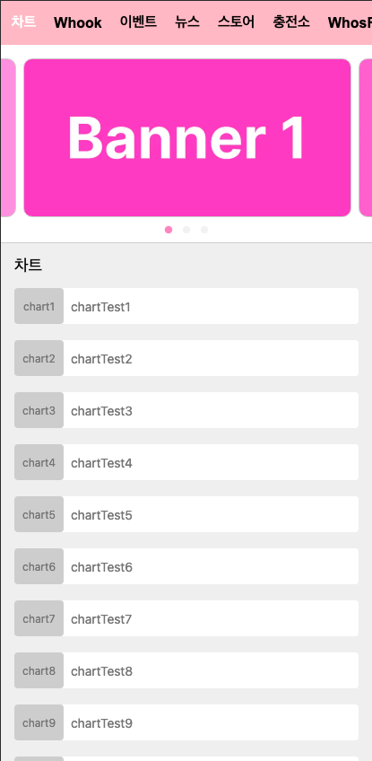

# 한터글로벌 코딩테스트 프로젝트

vercel url: https://hanteo-project.vercel.app/

### 결과 페이지



## 1. 구현 방법

무한 루프동작 슬라이드

```
import Slider from 'react-slick';
// react-slick의 기본 스타일링
import 'slick-carousel/slick/slick.css';
import 'slick-carousel/slick/slick-theme.css';
import '../style/slick-style.css'; // Slider css 커스텀

// Slider 기초 세팅
let settings = {
  arrows: false, // 화살표 유무
  dots: true, // 점 유무
  infinite: true, // 무한 루프 유무
  speed: 500, // 애니메이션 속도
  slidesToShow: 1, // 한번에 보일 슬라이드 수
  slidesToScroll: 1, // 한번에 넘길 슬라이드 수
  centerMode: true, // 슬라이드 중앙 정렬
  centerPadding: '20px', // 슬라이드의 양옆의 패딩
};

return (
  <WrapSlider className='slider-container'>
    <Slider {...settings}>
      ... // 슬라이드 카드 넣기
    </Slider>
  </WrapSlider>
);
```

무한 스크롤

```

useEffect(() => {
  setLoading(true);
  getContent(page);
}, [page]);

useEffect(() => {
  const observer = new IntersectionObserver(
    (entries) => { // 트리거가 화면에 얼마나 교차되어있는지에 대한 정보를 갖고 있음
      // 첫번째 트리거가 화면에 100% 나왔을 시 entries[0].isIntersection = true
      if (entries[0].isIntersecting && !loading) {
        setPage((prev) => prev + 8);
      }
    },
    { threshold: 1.0 } // 요소가 100% 화면에 보여야 감지됨
  );

  // observerRef가 현재 참조하고 있는 DOM 요소를 감지 대상으로 설정
  if (observerRef.current) observer.observe(observerRef.current);

  return () => observer.disconnect(); // 컴포넌트가 언마운트되거나 업데이트될 때 IntersectionObserver 해제
}, [loading]);

return (
  <div // IntersectionObserver의 감지대상, 트리거
    ref={observerRef}
    style={{ height: '20px', background: 'transparent' }}
  />
);
```

슬라이드 터치

```
const handlers = useSwipeable({
    onSwipedLeft: () => navigate(router[pathname].left), // 오른쪽에서 왼쪽으로 슬라이드 시 카테고리 이동
    onSwipedRight: () => navigate(router[pathname].right), // 왼쪽에서 오른쪽으로 슬라이드 시 카테고리 이동
    preventScrollOnSwipe: true, // 스크롤 방지
    trackMouse: true, // 마우스 이벤트 감지
  });

return (
    <div {...handlers}>
      ... // 내부에서 슬라이드 시 작동
    </div>
)
```

카테고리 리스트 뷰 무한 스크롤

```
useEffect(() => {
  const scrollContainer = scrollRef.current;

  if (!scrollContainer) return;

  // scrollWidth를 scrollContainer의 1/3로 설정하여 초기 위치 설정
  const scrollWidth = scrollContainer.scrollWidth / 3;
  scrollContainer.scrollLeft = scrollWidth;

  const handleScroll = () => {
    // 왼쪽 끝에 도달하면 scrollLeft를 scrollWidth로 설정하여 순환
    if (scrollContainer.scrollLeft <= 0) {
      scrollContainer.scrollLeft = scrollWidth;
    // 오른쪽 끝에 도달하면 scrollLeft를 scrollWidth * 2로 설정하여 순환
    } else if (scrollContainer.scrollLeft >= scrollWidth * 2) {
      scrollContainer.scrollLeft = scrollWidth;
    }
  };
  // 이벤트 리스너 추가
  scrollContainer.addEventListener('scroll', handleScroll);
  // 컴포넌트가 언마운트될 때 이벤트 리스너 제거
  return () => scrollContainer.removeEventListener('scroll', handleScroll);
}, []);

return (
  <ScrollContainer ref={scrollRef}>
    // 스크롤이 양끝에 도착하면 다시 처음으로 돌아가게 하기 위해 카테고리 list를 3번 반복
    {[...list, ...list, ...list].map((val, idx) => (
      <ListContent
        key={idx}
        status={path === val.location ? 'true' : 'false'}
        onClick={() => navigate(val.location)}
      >
        {val.name}
      </ListContent>
    ))}
  </ScrollContainer>
);
```

### 사용한 라이브러리

react-slick, slick-carousel : 높은 커스터마이징을 제공하고, 간단한 설정으로 무한 슬라이드 기능을 구현할 수 있어 채택

react-swipeable : 가볍고 직관적인 api로 빠르게 구현할 수 있어 채택

msw : 무한 스크롤 구현시 클라이언트에서 네트워크 요청을 더 사실적으로 테스트하고 싶었고, 클라이언트와 서버의 동작을 동일한 방식으로 mocking할 수 있어 채택

## 2. 실행 방법

```
yarn run dev
```

## 3. 느낀점

이번 개발을 통해 코드의 간결함과 확장성을 고려하는 것이 얼마나 중요한지 깨달았습니다. 한 컴포넌트에서 router값에 따라 API를 다르게 호출함으로써 중복 코드를 줄이고, 수정이 필요한 경우 최소한의 변경으로 여러 곳에 적용할 수 있게 되어 유지보수가 훨씬 용이해졌습니다.

또한, HTML과 CSS를 간결하게 작성함으로써 코드 관리가 더 쉬워졌습니다. 무한 스크롤을 구현하면서 Intersection Observer API의 효율성을 느낄 수 있었고, 페이지네이션 방식에서 벗어나 자동으로 데이터를 불러오는 방식이 매우 편리하고 간단하다는 것을 알게 되었습니다. 전체적으로 최적화된 방식으로 개발을 진행하는 것이 얼마나 중요한지 실감했습니다.

## 4. 문제 해결

https://velog.io/@llmeajinll/series/%ED%94%84%EB%A1%9C%EC%A0%9D%ED%8A%B8
